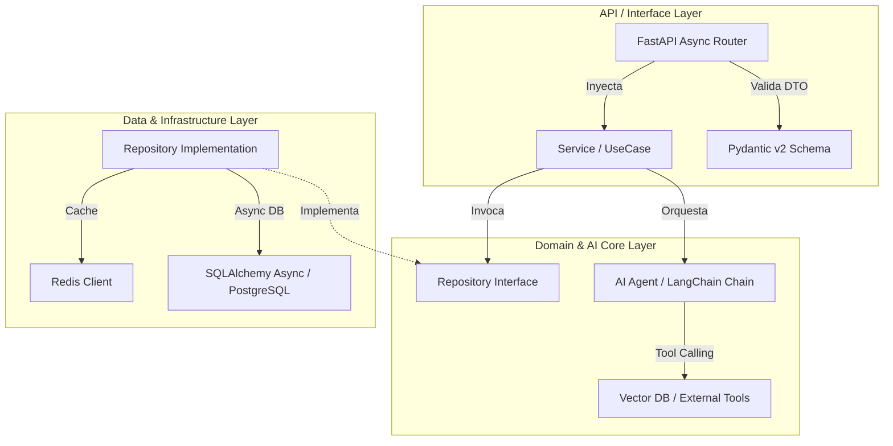

# Arquitectura Canónica — Python (Clean Architecture, AI Agents & Microservicios)

Patrones de diseño de software para microservicios asíncronos y orquestación de Agentes de IA en Python.

---

## 🏛️ 1. Diagrama de Capas de la Arquitectura

---

## 📐 2. Responsabilidades por Capa

### A. API Layer (FastAPI Routers & Schemas)
* **Routers**: Endpoints asíncronos limpios que reciben datos, delegan la lógica a los servicios inyectados y retornan esquemas Pydantic.
* **Inyección de Dependencias**: Usar `Depends()` nativo de FastAPI para inyectar instancias de servicios y sesiones de base de datos (`AsyncSession`).

### B. AI Agent Layer (Orquestadores & RAG)
* **Chains / Agents**: Encapsulan la interacción con LLMs (OpenAI, Anthropic, Gemini) mediante LangChain o LlamaIndex.
* **Tool Calling**: Definir funciones Python puras anotadas como `@tool` con tipos de entrada estrictos y docstrings explicativos para que el LLM entienda su uso.
* **Retrieval-Augmented Generation (RAG)**: Integrar almacenes vectoriales (Chroma, Qdrant, Pinecone) de manera aislada tras un cliente de base de datos vectorial.

### C. Domain Layer (Lógica Pura de Negocio)
* **Services**: Encapsulan las reglas de negocio sin acoplamiento a la base de datos concreta ni al framework HTTP.
* **Interfaces**: Clases base abstractas (`abc.ABC`) que definen el contrato de repositorios.

### D. Infrastructure Layer (Persistencia & Red)
* **SQLAlchemy v2 Async**: Uso de `AsyncSession`, `select()` declarativo y modelos declarativos ORM (`Mapped[str]`).
* **HTTP Clients**: Uso exclusivo de `httpx.AsyncClient` para llamadas HTTP asíncronas salientes.
